Features that need to be tested: 
1. Creating an account.
1. Logging out of and into your account.
1. Creating a new, fully featured, method.
1. Editing your method.
1. Deleting your method.
1. Viewing methods created by other users.
1. Searching for a method.
1. Viewing your uploaded methods on your profile page.
1. As an admin, creating, editing, and deleting method categories.
1. All links functional, including social media links in the footer. 

If all these features can be shown to work, then all the User Stories, outlined in this project’s ReadMe, will be completable. Below are steps explaining how to perform each test, with accompanying images from my own testing.

### Feature 1 (Creating an account)
1. Click the sign up button.

1. Fill in the sign up form with a unique username and password, making sure that your inputs meet the expected format. The format is between 5 and 15 characters (enforced on both front and backend), which can be any letter (upper or lowercase), or any digit (0-9).

1. You will now be redirected to your profile page.
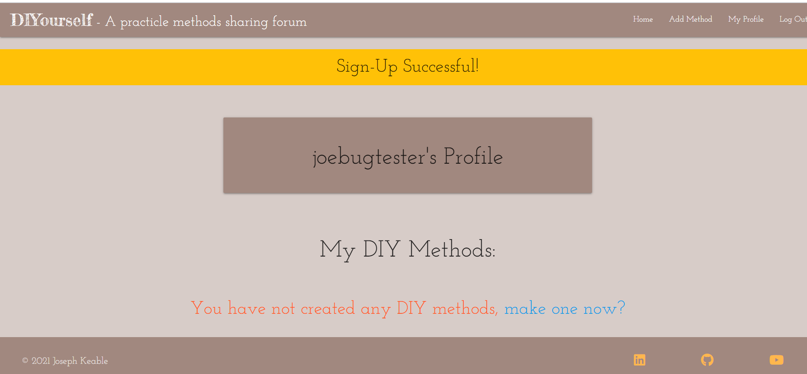

### Feature 2 (Logging out of and back into your account)
1. Click the “log out” button, and be redirected to the login page. Alternatively, you can navigate to the login page from the nav bar.

1. Enter your log in details and click log in.
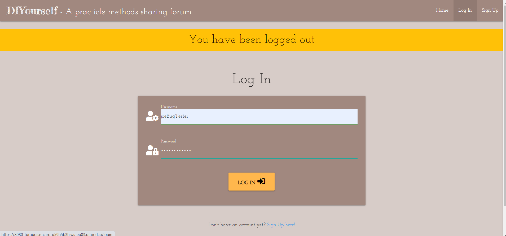

1. You will be redirected to your profile page.

### Feature 3 (Creating a new, fully featured, method.)
1. Once logged in, click “Add New Method” from the nav bar or “make one now” from your profile page.

1. Fill out the method form with your method’s details, including a youtube link (you can use a sharing link or the link that you will find in your browser's url bar.) Click “Create Method” when done.

1. You will be redirected to the homepage, a flash message will inform you that you have successfully added a new method.
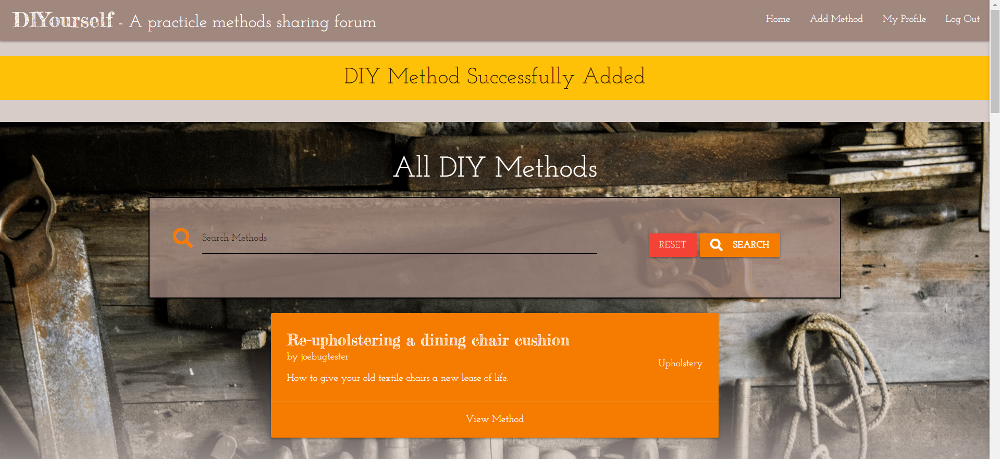

1. Click “View Method” to see your new method in all its glory!
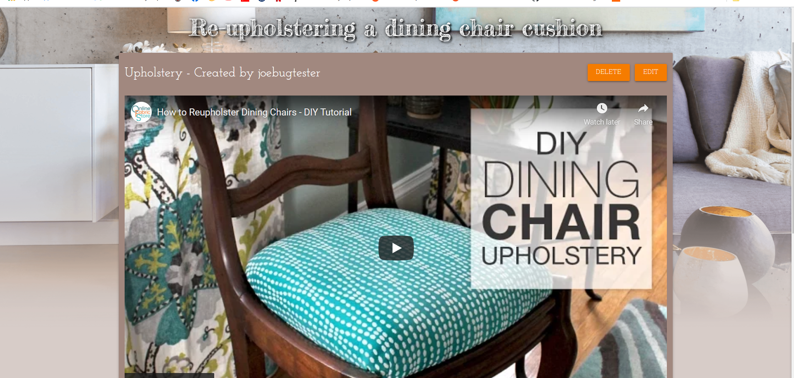

### Feature 4 (Editing your method)
1. From your methods page, when you are logged into your account, click the edit button in the top right of your method’s card.

1. Make any changes to the form for your method, which will be populated with the method’s current information by default.
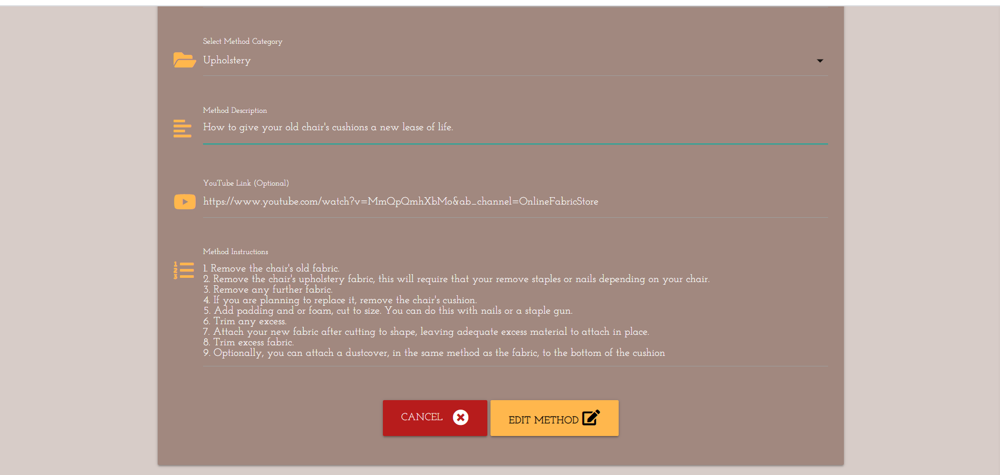

1. Click “Edit Method”, you will be redirected to your method’s page, where a flash message will inform you that your method has been updated.
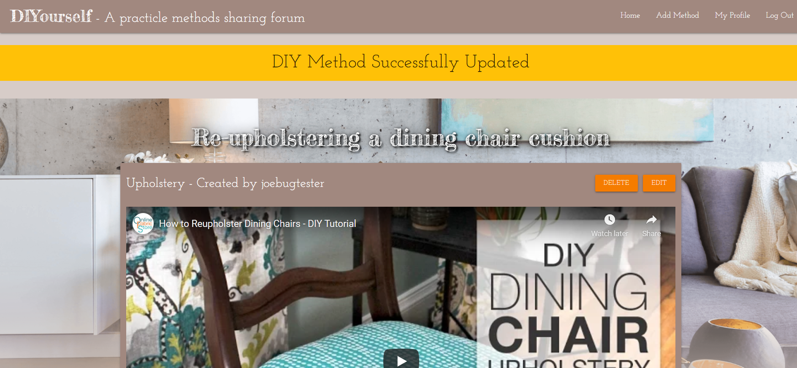

### Feature 5 (Deleting your method)
1. When logged in, navigate to your method either from the homepage or your profile page.

1. When you are on your method’s page you will know that you are logged in if you can see the edit and delete buttons. Click the delete button.
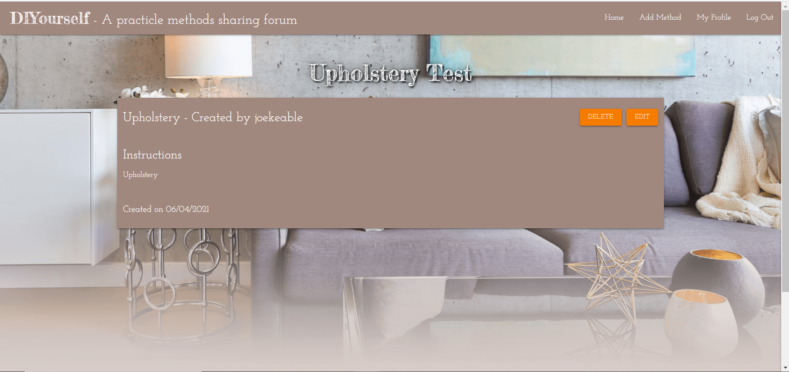

1. A pop-up box will ask if you're sure you want to delete the method. Click “OK”

1. You will be redirected to the site’s homepage with a popup informing you that your method has been deleted. 
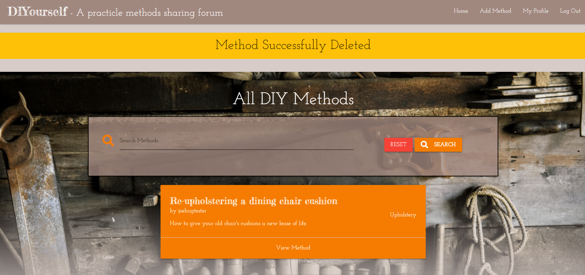

### Feature 6 (Viewing method’s created by other users)
1. Either logged in or not, click on the method of another user from the homepage.

1. You will now be on the page for this method. You can view it in its entirety but you cannot edit or delete it (unless you have an admin account, which can delete methods it did not create).
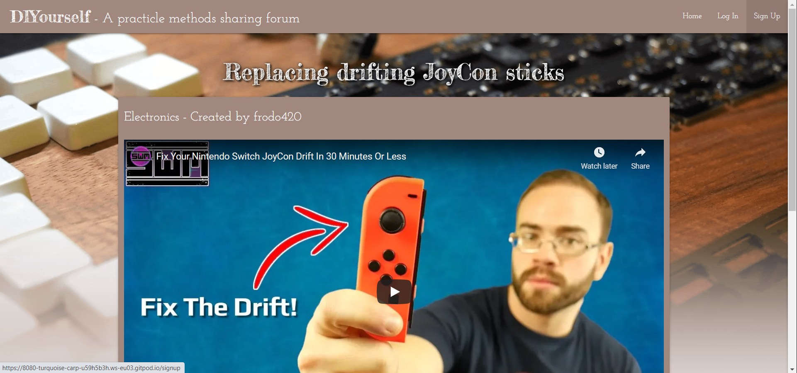

### Feature 7 (Searching for a method)
1. On the homepage, type a query into the search bar and click search (for testing purposes, make it something you know should produce results). This will produce a list of results that contain your search term in the title, description, or method steps.
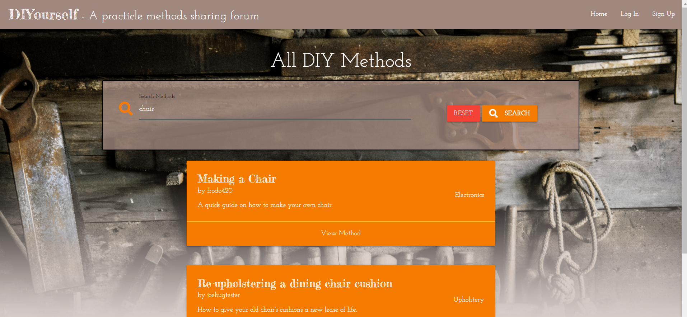

1. Click “reset”, this will return the default list of all the methods on the site.
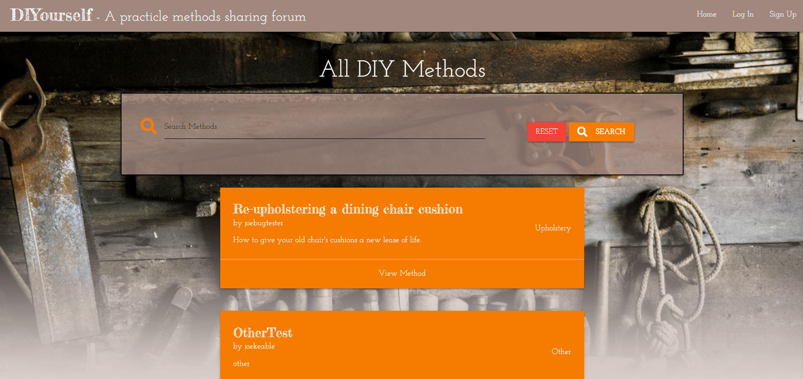

1. For testing purposes, try searching for something you know wont produce any results, like a random string.

1. You should see nothing returned but a message saying “no results found”. You can press reset to return the list of all methods. 

### Feature 8 (Viewing your uploaded methods on your profile page.)

1. Log into your account, you will be redirected to your account page. If you are already logged in, click “My Profile” from the nav bar. 
1. On your profile page scroll down, you should see a list of your submitted methods. You can access any of them from here.
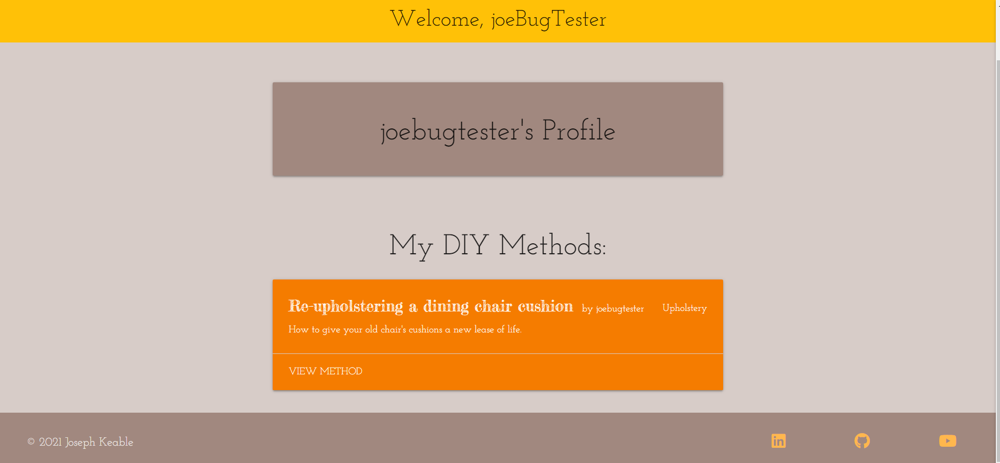

### Feature 9 (As an admin, creating, editing, and deleting method categories.)

1. Log into your admin account. This is really only possible for me, as an account’s admin status is determined on the backend, but I will include the steps that I took to test this functionality anyway. 

1. From your profile page, you will see a list of the currently existing categories, click “add category”
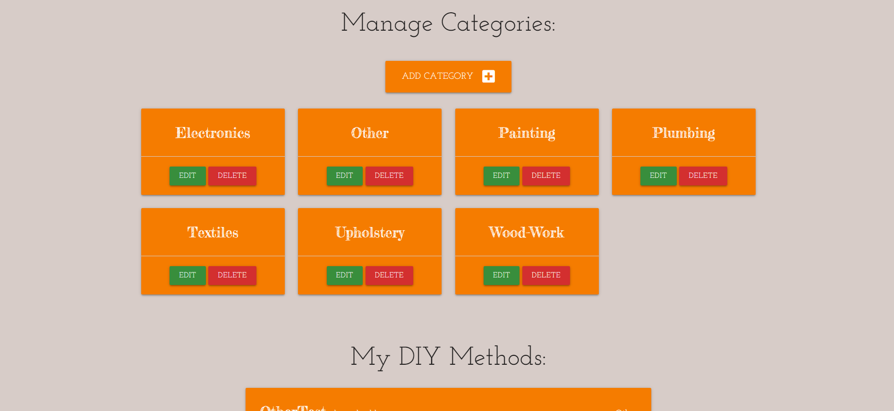

1. You will now be on a page to add a new category, fill in its name and press “Create a category”.
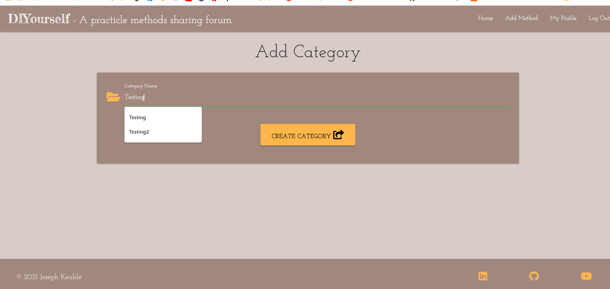

1. Your will be redirected to your profile page and a flash message will inform you that you have created a new category.
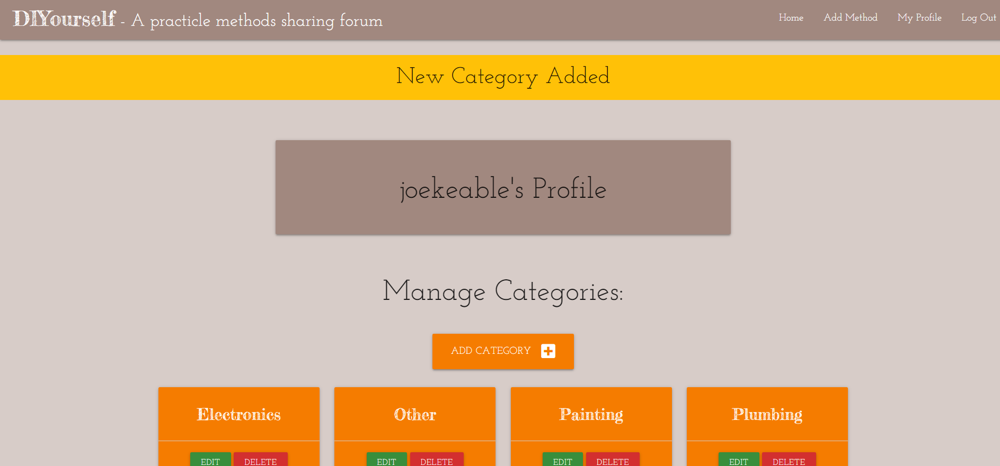

1. Find the category you want to edit from the list and click edit, you will be sent to a form to edit the category.

1. Rename the category whatever you want and click “edit category”, you will be redirected to your profile page and a flash message will say that your category has been successfully updated.
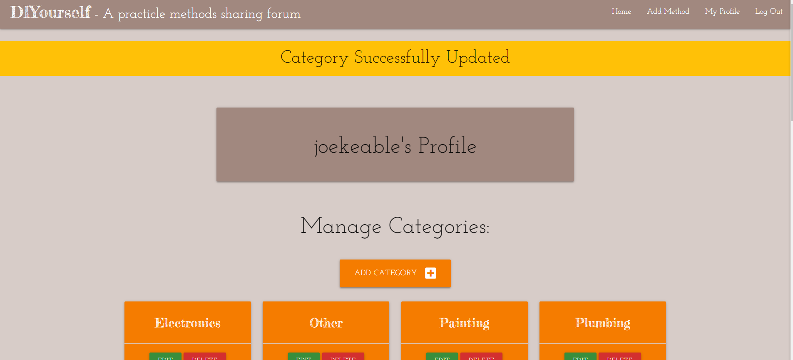

1. Find the category that you want to delete from the list, and click delete category, confirm the pop up box.
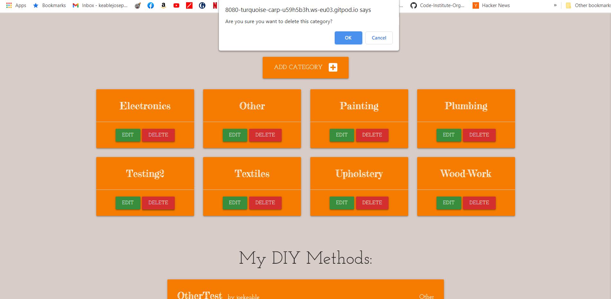

1. You will be redirected to your profile page and a flash message will inform you that the category has been deleted.
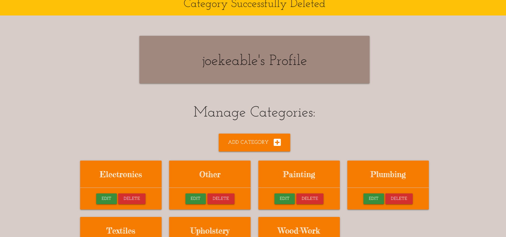 

### Feature 10 (All links functional, including social media links in the footer.)

1. Click all the links on the site and make sure they do what you are expecting. You should have already done this with most of them except the footer social media links.
1. Ensure the social media links open in a new tab (not pictured).

<!-- In addition, you should mention in this section how your project looks and works on different browsers and screen sizes. -->